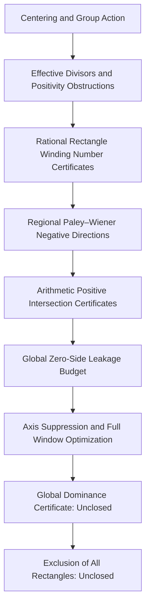

# From Equivariant Zero Obstructions to Validated Arithmetic Intersections
## An Integrated Research Program on Local Certificates, Explicit Formulae, and Global Leakage for the Riemann Hypothesis

**English Title:** *From Equivariant Zero Obstructions to Validated Arithmetic Intersections: An Integrated Program for Local Certificates, Explicit Formulae, and Global Leakage in the Riemann Hypothesis*  
**Author:** Neo.K (Chuan-Wei Hsu)  
**Institution:** EveMissLab / Yiyannuo Technology Co., Ltd.  
**Integration Collaboration and Technical Audit:** OpenAI Codex  
**Version:** v1.0 (Integrated Internal Research Draft)  
**Date:** 2026-07-24  
**Case ID:** `CASE-0001-RH-EAO-INTEGRATION-20260724`  
**Parent Case:** `CASE-0001-RH-WEIL-BATCH01`  
**Status:** Replayable research integration package; does not constitute a proof or disproof of the Riemann Hypothesis

---

## Important Declaration

This integrated draft is not a proof of the Riemann Hypothesis.

This draft compiles six theoretical documents and six computation/certificate packages into a single research chain with explicit types, dependencies, evidence levels, and failure records. After integration, the following can be confirmed:

1. The RH has been legitimately rewritten as the vanishing problem of the off-axis positivity obstruction for equivariant effective divisors;
2. The off-axis obstruction has been localized into positive winding number certificates on countable rational rectangles;
3. Assuming a certain off-axis rectangle contains zeros, one can construct a Paley–Wiener orbital block that is uniformly negative over that entire rectangle;
4. A single explicit test function has been found such that "continuous regional negative values in the target" and "a positive arithmetic scalar" hold simultaneously, forming a replayable validated numerical certificate;
5. The current test function fails to achieve global zero-side dominance: the positive contribution from just the first known critical line zero is approximately $2387.591$ times the target negative margin;
6. After incorporating finite critical line cancellations, the target negative value and arithmetic positive value can still coexist, but the arithmetic positive directions collapse rapidly as cancellation conditions increase, and significant positive peaks still appear across the full control window;
7. Therefore, the true unclosed main gap at present is no longer "whether a regional negative direction exists," but rather:

$$
\boxed{
\text{Validated target negative value}
\;\dashrightarrow\;
\text{Unconditional global zero-side negative value}
}
$$

and:

$$
\boxed{
\text{Every hypothetical off-axis rectangle}
\;\dashrightarrow\;
\text{Test function with both an arithmetic positive certificate and global dominance}
}
$$

---

# Abstract

Let the Riemann completed function be:

$$
\xi(s)
=
\frac12s(s-1)\pi^{-s/2}
\Gamma\!\left(\frac{s}{2}\right)\zeta(s),
$$

and perform centering:

$$
z=s-\frac12,
\qquad
F(z)=\xi\!\left(\frac12+z\right).
$$

If:

$$
z=\beta+i\gamma,
$$

then the RH is equivalent to:

$$
F(z)=0
\Longrightarrow
\beta=0.
$$

The functional equation and real structure generate a Klein four-group action after centering:

$$
a(z)=-z,
\qquad
b(z)=\overline z,
\qquad
j(z)=-\overline z,
$$

where:

$$
\operatorname{Fix}(j)=i\mathbb R.
$$

By writing the zeros of $F$ according to their multiplicities as a locally finite, $G$-invariant effective divisor $D_F$, we can define the off-axis positivity obstruction:

$$
\mathfrak O(D_F)
=
D_F|_{X\setminus i\mathbb R}.
$$

Thus:

$$
\mathrm{RH}
\iff
\mathfrak O(D_F)=0.
$$

In the right-half centered critical strip $X^+$, for every relatively compact rational rectangle $R$ with no zeros on its boundary, define:

$$
\omega_R(F)
=
\frac{1}{2\pi i}
\oint_{\partial R}
\frac{F'(z)}{F(z)}\,dz.
$$

By the argument principle:

$$
\omega_R(F)=D_F(R)\in\mathbb N_0,
$$

hence:

$$
\mathrm{RH}
\iff
\omega_R(F)=0
\quad
\text{for all regular rational rectangles }R\Subset X^+.
$$

Using the spectral coordinate:

$$
w=-iz=\gamma-i\beta,
$$

the critical axis is mapped to the real axis, and the right-half centered strip is mapped to $\operatorname{Im}w<0$. In the logarithmic coordinates of the explicit formula over the multiplicative group, let:

$$
\psi(t)=e^{t/2}g(e^t),
$$

and:

$$
G(w)
=
\int_{\mathbb R}
\psi(t)e^{iwt}\,dt
=
\widetilde g\!\left(\frac12+iw\right).
$$

If $\psi$ is a real even function, then:

$$
G(-w)=G(w),
\qquad
G(\overline w)=\overline{G(w)}.
$$

The orbital block in the explicit formula is:

$$
B_w(G)
=
2\operatorname{Re}\!\left(G(w)^2\right).
$$

When $w\in\mathbb R$, the zero contribution is $|G(w)|^2\ge0$; when $w\notin\mathbb R$, $B_w(G)$ can be negative. This provides a local negative direction for off-axis zeros.

The integrated engineering results show: there exists an explicit piecewise linear function supported on $[-3,3]$ such that:

$$
\sup_{w\in K}
2\operatorname{Re}\!\left(G(w)^2\right)
\le
-2.2416560599\times10^{-6},
$$

where:

$$
K=[8,8.5]+i[-0.2,-0.1],
$$

and the same function satisfies:

$$
Q_{\mathrm{arith}}(\psi)
\in
[0.033762674558557,\ 0.061347696341296].
$$

This proves that under the adopted finite model and validated numerical trust boundaries, the intersection of the regional negative class and the arithmetic positive scalar class is non-empty. However, it does not prove that the arithmetic matrix is positive semi-definite over any function space, nor does it control all zeros outside the target. The leakage budget further yields:

$$
\frac{
\text{Contribution of the first known on-axis zero}
}{
\text{Target negative margin}
}
\approx
2387.591,
$$

Therefore, a single-target strategy is infeasible without strong axis suppression and global window control.

Accordingly, this document redefines the next research node as the "Global Dominance Certificate": instead of merely maximizing the negative value of the target rectangle, it directly maximizes the strict residual amount of the target negative value after deducting the upper bounds of the on-axis, mid-window, unknown off-axis, and infinity tail contributions.

**Keywords:** Riemann Hypothesis, Equivariant Topology, Effective Divisor, Off-Axis Positivity Obstruction, Winding Number Certificate, Riemann–Weil Explicit Formula, Paley–Wiener, Validated Numerics, Arithmetic Positive Cone, Zero-Side Leakage, Global Dominance

---

# 1. Integration Targets and Research Positioning

## 1.1 Six Theoretical Documents

The theoretical sequence compiled in this integrated draft is:

1. "From Centering to Equivariant Topology: Thinking Methods and Methodological Groups for Legitimate RH Decidability Research";
2. "Equivariant Topological Decision Domains After Centering: RH Divisor Fixed Points and Winding Number Obstruction Reconstruction";
3. "Equivariant Zero Configuration Topology: RH Orbit Type Stratification, Effective Divisor Semirings, and Positivity Obstructions";
4. "Sheafified Zero Obstructions and Local-Global Lifting: From Rational Rectangle Certificates to Full Critical Strip Decidability";
5. "Equivariant Arithmetic Separation: From Orbit Space Localization to Admissible Test Functions for the ζ Explicit Formula";
6. "Off-Axis Positivity Obstructions in the Explicit Formula: Zero-Side Regional Negative Directions, Prime-Side Computable Cones, and ZFC Contradiction Frameworks".

## 1.2 Six Engineering Packages

The computation and certificate sequence is:

1. `RH_Regional_Phase_Shaping_v0.1`;
2. `RH_Arithmetic_Matrix_PSD_v0.1`;
3. `RH_Separation_Positivity_Intersection_v0.1`;
4. `RH_Validated_Intersection_Certificate_v0.2`;
5. `RH_Zero_Side_Leakage_Budget_v0.1`;
6. `RH_Axis_Suppressed_Global_Window_Optimizer_v0.1`.

These are not six competing routes, but six engineering nodes within the same research chain.

---

# 2. Unified Notation and Normalization

## 2.1 Three Coordinates

This series simultaneously uses three coordinates: $s$, $z$, and $w$:

| Coordinate | Definition | Critical Line/Axis | Off-Axis Direction |
|---|---|---|---|
| $s$ | Original ζ coordinate | $\operatorname{Re}s=\frac12$ | $\operatorname{Re}s\ne\frac12$ |
| $z$ | $z=s-\frac12=\beta+i\gamma$ | $\operatorname{Re}z=0$ | $\beta\ne0$ |
| $w$ | $w=-iz=\gamma-i\beta$ | $\operatorname{Im}w=0$ | $\operatorname{Im}w\ne0$ |

The conversion relations are:

$$
s=\frac12+z=\frac12+iw.
$$

If:

$$
w=x+iy,
$$

then:

$$
s=\left(\frac12-y\right)+ix.
$$

Therefore, the target rectangle used by the engineering packages:

$$
K=[8,8.5]+i[-0.2,-0.1]
$$

corresponds to:

$$
0.6\le\operatorname{Re}s\le0.7,
\qquad
8\le\operatorname{Im}s\le8.5.
$$

This is a synthetic target region used to validate the geometric and arithmetic intersection of functions. The existing packages do not provide a winding number certificate indicating that this rectangle contains ζ zeros, nor do they use it as evidence for the actual existence of off-axis zeros.

## 2.2 Two Types of "Positivity" Must Not Be Confused

Two completely different types of positivity appear simultaneously in this series.

The first is divisor positivity:

$$
\mathfrak O(D_F)\ge0.
$$

It indicates that off-axis zeros exist with non-negative multiplicities and cannot be canceled by formal negative coefficients.

The second is arithmetic quadratic form or scalar positivity:

$$
Q_{\mathrm{arith}}(\psi)>0.
$$

It indicates that a certain test function has a positive arithmetic value under the adopted explicit formula normalization.

The current rigorous intersection certificate only proves:

$$
\exists\psi:
\quad
\sup_{w\in K}B_w(G_\psi)<0
\quad\land\quad
Q_{\mathrm{arith}}(\psi)>0.
$$

It does not prove:

$$
M_{\mathrm{arith}}\succeq0,
$$

nor does it prove:

$$
Q_{\mathrm{arith}}(\psi)\ge0
\quad
\text{holds for all functions in a certain dense class}.
$$

---

# 3. Integrated Research Architecture

This chain can be divided into four different types of work.

| Layer | Primary Function | Completion Status |
|---|---|---|
| Decision Layer | Precisely represents RH equivalent conditions | Structurally complete |
| Local Certificate Layer | Converts off-axis existence into positive integer certificates | Structurally complete |
| Arithmetic Intersection Layer | Searches for functions that are simultaneously regionally negative and arithmetically positive | Validated for a single model |
| Global Dominance Layer | Controls all non-target zeros and tails | Not yet complete |

---

# 4. Decision Layer: From Centering to Positivity Obstructions

## 4.1 Ambient Space with Marked Involution

Let:

$$
X=
\left\{
z\in\mathbb C:
\left|\operatorname{Re}z\right|<\frac12
\right\},
$$

and:

$$
A=i\mathbb R.
$$

The involution:

$$
j(z)=-\overline z
$$

satisfies:

$$
\operatorname{Fix}(j)=A.
$$

This preserves the information of "which line is the critical line," preventing bare topology from treating different embedded lines as arbitrarily movable.

## 4.2 Zero Divisors and Axial Idempotent Operators

Write the zeros as:

$$
D_F=\sum_\rho m_\rho[\rho].
$$

On the closed critical strip, define:

$$
r(z)=i\,\operatorname{Im}z,
$$

and the divisor pushforward:

$$
\mathcal R(D)=r_*D.
$$

Then:

$$
\mathcal R^2=\mathcal R,
$$

and:

$$
\mathcal R(D)=D
\iff
\operatorname{supp}D\subseteq A.
$$

Therefore:

$$
\mathrm{RH}
\iff
\mathcal R(D_F)=D_F.
$$

This is a diagnostic fixed-point equivalence, not an analytic dynamics that moves zeros to the critical line.

## 4.3 Positive Burnside Semirings and Non-cancelability

The $G$-orbit types in a finite window can be recorded in the positive Burnside semiring $A^+(G)$. The off-axis projection preserves general four-point orbits and real-axis-type off-axis orbits:

$$
\pi_{\mathrm{off}}^+\tau_W(D)
=
\left(n_e(W),n_b(W)\right).
$$

Since the coefficients lie in $\mathbb N_0$:

$$
\pi_{\mathrm{off}}^+\tau_W(D)=0
\iff
W\text{ contains no off-axis orbits}.
$$

The value of this step is to prevent formal groupification from causing positive-negative cancellations that do not exist in the true zero divisor.

---

# 5. Local Certificate Layer: From Sheaves to Countable Rectangles

## 5.1 Off-Axis Obstruction Sheaf

For an open set $U\subseteq X$, define:

$$
\mathscr O^+(U)
=
\operatorname{Div}_{\mathrm{lf}}^+(U\setminus A).
$$

The fixed function $F$ generates a global section:

$$
\mathfrak o_F\in\Gamma(X,\mathscr O^+).
$$

Therefore:

$$
\mathrm{RH}
\iff
\mathfrak o_F=0.
$$

Sheaf theory handles local restrictions and gluing, but does not provide independent reasons for each stalk being zero.

## 5.2 Rational Rectangle Decision Family

In the right-half strip:

$$
X^+
=
\left\{
z:
0<\operatorname{Re}z<\frac12
\right\}
$$

take a relatively compact rational rectangle $R$. If $F$ has no zeros on $\partial R$, then:

$$
\omega_R(F)
=
\frac{1}{2\pi i}
\oint_{\partial R}
\frac{F'(z)}{F(z)}\,dz
=
D_F(R).
$$

By the discreteness of zeros and the basis property of rational rectangles:

$$
\boxed{
\mathrm{RH}
\iff
\omega_R(F)=0
\quad
\text{for all regular rational rectangles }R\Subset X^+.
}
$$

This compiles the global proposition into a countable family of certificates, but "countable" is still not "finite."

## 5.3 Regular Exhaustion and Finite Validation Boundaries

If:

$$
U_1\Subset U_2\Subset\cdots\Subset X^+,
\qquad
\bigcup_{n\ge1}U_n=X^+,
$$

and every boundary avoids zeros, then:

$$
\mathrm{RH}
\iff
\omega_{U_n}(F)=0
\quad
\forall n.
$$

However, any finite prefix only proves the absence of off-axis zeros in a finite region. It cannot eliminate:

$$
X^+\setminus U_N.
$$

---

# 6. Analytic Lifting Layer: From Rectangle Existence to Regional Negative Directions

## 6.1 Explicit Formula Test Functions

On the multiplicative group $\mathbb R_+^\times$, let:

$$
g^\sharp(x)=x^{-1}g(x^{-1}),
$$

and define:

$$
f_g=g*\overline g^{\,\sharp}.
$$

Its Mellin transform is:

$$
\widetilde f_g(s)
=
\widetilde g(s)
\overline{
\widetilde g(1-\overline s)
}.
$$

If:

$$
\widetilde g(0)=\widetilde g(1)=0,
$$

then under the adopted explicit formula normalization:

$$
Q_\zeta(g)
=
\sum_\rho
\widetilde g(\rho)
\overline{
\widetilde g(1-\overline\rho)
}.
$$

The endpoint conditions in the $w$ coordinate become:

$$
G\!\left(\frac i2\right)
=
G\!\left(-\frac i2\right)
=0.
$$

## 6.2 Regional Phase Shaping

If a compact rectangle $K$ is separated from the real axis and $\pm i/2$, and satisfies the polynomial approximation conditions for its square image, the theoretical draft constructs a real even compactly supported $\psi$ such that:

$$
|G(w)-i|<\varepsilon
\qquad
\forall w\in K.
$$

Thus:

$$
B_w(G)
=
2\operatorname{Re}\!\left(G(w)^2\right)
\le
-2\left(1-2\varepsilon-\varepsilon^2\right)
<0.
$$

Therefore:

$$
\omega_R(F)>0
\Longrightarrow
\text{there exists a legitimate regional negative direction depending only on }R.
$$

This is the first arrow in this series that moves from pure decidability restatements into substantive function construction.

## 6.3 This Arrow is Still Not the Total Zero-Side Negative Value

Regional shaping only controls $K$. It does not automatically control:

$$
\sum_{\rho:\,w_\rho\notin K}
B_{w_\rho}(G).
$$

Hence, one must distinguish between:

$$
\text{local orbital blocks being negative}
$$

and:

$$
\text{the complete zero-side sum being negative}.
$$

The space between these two is precisely the current main GAP.

---

# 7. Arithmetic Side: Finite Prime Activation and Matrixification

## 7.1 Support-Prime Activation Filtration

If:

$$
\operatorname{supp}\psi
\subseteq
[-L/2,L/2],
$$

then the multiplicative support of the convolution square lies in:

$$
[e^{-L},e^L].
$$

The finite places only activate:

$$
m\log p\le L
$$

a finite number of prime powers. Thus, we can define:

$$
\mathcal P_L
=
\left\{
(p,m):
m\log p\le L
\right\}.
$$

This makes the arithmetic side on a fixed support scale a finitely computable problem.

## 7.2 Finite-Dimensional Arithmetic Matrix

For a basis $\psi_1,\ldots,\psi_N$ and:

$$
\psi_c=\sum_{j=1}^Nc_j\psi_j,
$$

we can write:

$$
Q_{\mathrm{arith}}(\psi_c)
=
c^\top
M_{\mathrm{arith}}(L)c,
$$

where:

$$
M_{\mathrm{arith}}(L)
=
M_\infty
+
M_{\mathrm{fin}}(L).
$$

If one can prove:

$$
M_{\mathrm{arith}}(L)\succeq0,
$$

then an arithmetic non-negativity certificate for the entire space spanned by the basis is obtained.

However, the strongest v0.2 result at present is the strict scalar positivity of a single vector/single function:

$$
c^\top M_{\mathrm{arith}}c>0.
$$

This is far weaker than matrix positive semi-definiteness.

---

# 8. Integration Results of the Six Engineering Nodes

## 8.1 Node C1: Regional Phase Shaping

`RH_Regional_Phase_Shaping_v0.1` uses a real even pairwise bump basis to accomplish:

- Floating-point constraints for endpoint conditions;
- Phase approximation on the target rectangle;
- Negative block search on dense grids;
- Candidate continuous bounds via analytic Lipschitz estimation.

The evidence level is a floating-point numerical prototype. It establishes feasibility, not a rigorous continuous regional certificate.

## 8.2 Node C2: Arithmetic Matrix / PSD Prototype

`RH_Arithmetic_Matrix_PSD_v0.1` implements:

$$
M_{\mathrm{arith}}(R)
=
M_\infty(R)
+
M_{\mathrm{fin}}(R).
$$

It scans support radii, activated prime powers, and minimum eigenvalues, and completes time-domain/frequency-domain cross-checks. However, `numerical_psd=true` only indicates that no negative eigenvalues were found under the current discretization.

## 8.3 Node C3: Separation-Positivity Intersection

`RH_Separation_Positivity_Intersection_v0.1` simultaneously solves on the same coefficient vector:

$$
\max_{w\in K}B_w(G_c)<0,
$$

and:

$$
c^\top M_{\mathrm{arith}}c\ge\delta.
$$

The provided scans found floating-point intersection candidates for all $R=1.5,\ldots,4.0$. At $R=3.0$:

$$
Q_{\mathrm{total}}
\approx
0.0491749029435855,
$$

and the maximum block on the dense grid is approximately:

$$
-2.3078\times10^{-5}.
$$

This remains a finite grid and floating-point result.

## 8.4 Node C4: Rigorous Intersection Certificate v0.2

`RH_Validated_Intersection_Certificate_v0.2` rewrites the candidate into an explicit hat-spline:

$$
\psi(t)
=
\sum_{i=0}^{600}
y_i
\max\!\left(
1-\frac{|t-t_i|}{h},
0
\right),
$$

where:

$$
h=0.01,
\qquad
t_i=-3+ih.
$$

Its Fourier transform has a closed form:

$$
G(w)
=
h
\left(
\frac{\sin(wh/2)}{wh/2}
\right)^2
\sum_{i=0}^{600}y_i e^{iwt_i}.
$$

Replaying yields:

$$
\sup_{w\in K}B_w(G)
\le
-2.2416560599\times10^{-6},
$$

and:

$$
Q_{\mathrm{fin}}
\in
[-0.099762166120387,\,-0.099762166120386],
$$

$$
Q_\infty
\in
[0.133524840678940,\ 0.161109862461679],
$$

Therefore:

$$
Q_{\mathrm{arith}}
\in
[0.033762674558557,\ 0.061347696341296].
$$

The validation coverage includes $480$ sub-rectangles, with $0$ unresolved sub-rectangles, and $98$ activated prime powers.

The precise status of this result is:

$$
\boxed{
\text{Continuous regional negative certificate for a single explicit test function}
\;\cap\;
\text{Single arithmetic scalar positive interval}
\ne\varnothing.
}
$$

## 8.5 Node C5: Zero-Side Leakage Budget

`RH_Zero_Side_Leakage_Budget_v0.1` quantifies why the v0.2 function cannot yet produce a total zero-side negative value.

The target negative margin is:

$$
c_K
=
2.2416560599\times10^{-6}.
$$

The numerical contribution of the first known critical line zero is:

$$
0.005352157501758449,
$$

so:

$$
\frac{0.005352157501758449}{c_K}
\approx
2387.5908519.
$$

The cumulative mass of the first $50$ known on-axis zeros is:

$$
0.023723782340489427,
$$

which is approximately:

$$
10583.1500
$$

times the target margin.

The prototype tail upper bound is:

$$
8.667600624770651.
$$

Therefore, it is impossible for the current function to allow a single target rectangle to dominate the complete zero side.

## 8.6 Node C6: Axis Suppression and Full Window Optimization

`RH_Axis_Suppressed_Global_Window_Optimizer_v0.1` incorporates cancellation conditions for the first $q$ stored critical line ordinates.

The number of arithmetic positive directions decreases as $q$ increases:

| $q$ | Constrained Dimension | Arithmetic Positive Directions |
|---:|---:|---:|
| $0$ | $22$ | $12$ |
| $4$ | $18$ | $8$ |
| $8$ | $14$ | $4$ |
| $10$ | $12$ | $2$ |
| $12$ | $10$ | $1$ |
| $15$ | $7$ | $0$ |

The selected $q=12$ candidate has:

$$
Q_{\mathrm{arith}}
\approx
5.00000000001\times10^{-5},
$$

$$
\max_{w\in K_{\mathrm{target}}}B_w
\approx
-2.64607989612\times10^{-8},
$$

but the remaining mass of the first $50$ on-axis zeros is:

$$
1.54365729672\times10^{-4},
$$

and the maximum positive peak in the control window is:

$$
0.267543612562.
$$

Therefore:

$$
B_w<0
\text{ in the target window}
$$

and:

$$
Q_{\mathrm{arith}}>0
$$

can still coexist, but:

$$
B_w\le0
\text{ in the full control window}
$$

is not achieved.

This failure is not an invalid result. It reveals the first quantifiable structural tension of this route:

$$
\boxed{
\text{Increase in axis suppression degrees of freedom}
\Longrightarrow
\text{Rapid collapse of the arithmetic positive subspace}.
}
$$

---

# 9. Integrated Conditional Main Theorem

## 9.1 Global Dominance Certificate

For every regular rational rectangle $R\Subset X^+$, let its spectral image be:

$$
K_R=-iR.
$$

If one can construct a test function $\psi_R$ and constants $c_R>0$, $E_R\ge0$, such that:

$$
\omega_R(F)>0
\Longrightarrow
Q_{\mathrm{target}}(\psi_R)
\le
-c_R\omega_R(F),
$$

and:

$$
Q_{\mathrm{rest}}(\psi_R)
\le
E_R,
$$

and:

$$
E_R<c_R\omega_R(F),
$$

then:

$$
Q_{\mathrm{zero}}(\psi_R)<0.
$$

If the same function also has an arithmetic certificate independent of the RH:

$$
Q_{\mathrm{arith}}(\psi_R)\ge0,
$$

and the explicit formula strictly gives:

$$
Q_{\mathrm{zero}}(\psi_R)
=
Q_{\mathrm{arith}}(\psi_R),
$$

a contradiction is obtained.

## 9.2 Conditional Conclusion

If the above procedure holds for all regular rational rectangles, then:

$$
\omega_R(F)=0
\qquad
\forall R\Subset X^+,
$$

hence:

$$
\mathrm{RH}.
$$

## 9.3 Currently Satisfied and Unsatisfied Conditions

| Condition | Current Status |
|---|---|
| Uniform negative block within the target rectangle | Validated for a single synthetic rectangle; general existence has theoretical construction |
| Arithmetic scalar positive value for the same function | Validated for a single function |
| Target rectangle indeed contains off-axis zeros | No; the current target is a synthetic rectangle |
| Uniform upper bound for non-target finite windows | Not complete |
| Dominance over total critical line contribution | Not complete; current functions explicitly fail |
| Upper bound for unknown off-axis zero contributions | Not complete |
| Rigorous certificate for the infinity tail | Only prototype budget exists |
| Unified algorithm for all rational rectangles | Not complete |
| Proof assistant formalization of the explicit formula and interval certificates | Not complete |

---

# 10. Evidence Grading

This integration package adopts the following evidence levels:

| Level | Name | Definition |
|---|---|---|
| `E0` | Definition / Equivalent Restatement | Adds no new RH truth content |
| `E1` | Structural Theorem with Manuscript Proof | Has mathematical proof, but not yet externally reviewed or formalized |
| `E2` | Floating-Point Numerical Evidence | Has replayable code, no rigorous outer envelope |
| `E3` | Validated Numerical Certificate | Has continuous regional and interval outer envelopes, still relies on software trust base |
| `E4` | Verified Formal Proof | Verified by a proof assistant kernel |
| `E5` | Global RH Conclusion | Completes all infinite quantifiers and non-circular dependencies |

The current highest level is `E3`, applicable to the two strict inequalities of a single intersection function. `E4` and `E5` have not been achieved.

---

# 11. Closed, Partially Closed, and Unclosed GAPs

## 11.1 Closed

1. Equivalence between centering and the original RH proposition;
2. The critical line as the fixed set of the marked involution;
3. Equivalence between effective divisor fixed points and off-axis positivity obstructions;
4. Equality between regular rational rectangle winding numbers and regional zero multiplicities;
5. Equivalence between zero winding numbers for all regular rational rectangles and the RH;
6. Manuscript scheme for constructing uniformly negative Paley–Wiener blocks for fixed off-axis compact rectangles;
7. Fixed support activating only finite prime powers;
8. Validated numerical certificate of "continuous regional negative value ∩ arithmetic scalar positive value" for a single explicit function.

## 11.2 Partially Closed

1. Arithmetic matrix: can be numerically established and cross-checked, but lacks a general PSD certificate;
2. Infinity tail: has directions based on decay and zero counting, but the existing numerical budget is not yet a formal certificate;
3. Axis suppression: finite prefixes can be canceled, but this rapidly consumes arithmetic positive directions;
4. Full window control: has a swapping method prototype, but provided candidates still have large positive peaks;
5. Rigorous intersection: completed for a single synthetic rectangle, but a unified algorithm for arbitrary rectangles has not yet been formed.

## 11.3 Unclosed

1. Unconditional upper bounds for the contributions of all zeros outside the target;
2. Sign control for unknown finite-window off-axis zeros;
3. Maintaining finite support costs for rectangles arbitrarily close to the critical line;
4. Intersection of the arithmetic positive class and the regional separation class for all rectangles;
5. Lifting from a single arithmetic positive scalar to a usable structural positive cone;
6. Auditable generators for all rational rectangles;
7. Verified formalization of the complete explicit formula normalization and interval arithmetic;
8. RH.

---

# 12. The Next Main Research Node

## 12.1 Node Name

It is recommended to name the next node:

> **RH Global Dominance Certificate Optimizer v0.2**  
> **RH Global Dominance Certificate Optimizer v0.2**

## 12.2 Objective Function

No longer merely seeking:

$$
\min_\psi
\sup_{w\in K}B_w(G_\psi).
$$

Instead, directly maximize:

$$
\Delta_K(\psi)
=
c_K(\psi)
-
E_{\mathrm{axis}}(\psi)
-
E_{\mathrm{mid}}(\psi)
-
E_{\mathrm{tail}}(\psi)
-
E_{\mathrm{unknown}}(\psi).
$$

The success criteria are:

$$
\Delta_K(\psi)>0
$$

and:

$$
Q_{\mathrm{arith}}(\psi)\ge\delta>0.
$$

where all $E$ must be unconditional upper bounds, rather than observed values that only hold for the currently known zero samples.

## 12.3 Constraints

Must include at least:

$$
G\!\left(\pm\frac i2\right)=0,
$$

$$
\mathcal N(\psi)=1,
$$

$$
Q_{\mathrm{arith}}(\psi)\ge\delta,
$$

$$
\sup_{w\in K}B_w(G_\psi)\le-c_K,
$$

and, expressed via an unconditional zero-counting majorant:

$$
\sum_{\rho\notin K}
\max\!\left(B_{w_\rho}(G_\psi),0\right)
\le
E_{\mathrm{rest}}(\psi).
$$

## 12.4 Success Metrics That Should No Longer Be Used

If any of the following holds individually, it should not be marked as global progress:

1. The target grid is entirely negative;
2. A single arithmetic value is positive;
3. The first finite number of on-axis zeros are canceled;
4. A certain control window is mostly negative;
5. The floating-point minimum eigenvalue is positive;
6. The leakage on known zero samples is very small.

The new, sole primary metric should be:

$$
\boxed{
\text{Strict global dominance residual }\Delta_K>0.
}
$$

---

# 13. Formalization and Trust Boundaries

## 13.1 Replayed Items

This integration has completed:

- Five packages containing test suites, with a total of $15$ tests passed;
- Recalculation and passage of the v0.2 rigorous intersection certificate;
- All original `MANIFEST.sha256` hashes for v0.2 match;
- All original `MANIFEST.sha256` hashes for the axis suppression optimizer match;
- Recalculated values for the selected axis suppression candidate are consistent with the in-package report;
- Recalculated values for the zero-side leakage budget are consistent with the in-package report.

## 13.2 Trust Base of the v0.2 Certificate

Currently still trusting:

1. CPython and the operating system;
2. `mpmath` interval arithmetic;
3. Machine floating-point used for geometric bookkeeping;
4. Closed form of the hat-spline Fourier transform;
5. Closed form of the cubic autocorrelation;
6. The adopted Riemann–Weil normalization;
7. Input decimal node data.

Therefore, it is a validated numerical certificate, not a formal proof verified by a proof assistant kernel.

## 13.3 Formalization Priority

It is recommended to formalize in the following order:

1. Coordinates, group actions, and positivity obstruction equivalences;
2. Interfaces for rational rectangles and argument principle certificates;
3. Identities for the hat-transform and cubic autocorrelation;
4. Interval Taylor outer envelopes;
5. Archimedean composite midpoint errors;
6. Finite prime power enumeration and prime certificates;
7. The adopted explicit formula theorems;
8. Global leakage majorants.

---

# 14. Output to the AI Autonomous Mathematics Platform

This integration package defines the research unit as an "auditable GAP edge," rather than merely treating each paper as an isolated node.

The package provides:

- `case-manifest.json`: Case entry, security, and archive information;
- `research_nodes.json`: Theoretical and engineering nodes;
- `dependency_graph.json`: Typed dependency edges;
- `timeline.json`: Conceptual and engineering evolution;
- `certificate_index.json`: Certificates, replays, and trust boundaries;
- `gap_map.json`: Cross-paper, continuously updatable GAP map;
- `claim_ledger.json`: Claims and evidence levels;
- `failure_and_revision_log.json`: Failures, revisions, and research pivots;
- `trust_boundary.json`: Trust bases and unformalized parts;
- `artifact_catalog.json`: Source files and entries;
- `platform_import_manifest.json`: Platform import index;
- `handoff/unresolved_questions.md`: Unresolved questions;
- `handoff/next_experiment_spec.md`: Next experiment specifications;
- `validation/checksums.sha256`: Full package file hashes;
- `validation/test_report.json`: Current validation report.

---

# 15. Conclusion

After integrating these materials, the research status is much clearer than simply "having six more papers and six more code packages."

What has truly been completed is:

$$
\text{Off-axis existence}
\longrightarrow
\text{Positive divisor obstruction}
\longrightarrow
\text{Rational rectangle winding number}
\longrightarrow
\text{Uniform regional negative direction},
$$

and on a single explicit function:

$$
\text{Continuous regional negative value}
\quad\land\quad
\text{Arithmetic scalar positive value}.
$$

What has truly been vetoed by computation is:

$$
\text{As long as the local negative value is nice enough, it automatically overpowers the complete zero side}.
$$

This does not hold. The existing local negative margin is far smaller than the on-axis and tail leakages.

Therefore, the next step should no longer repeatedly generate nicer local negative plots, nor should it elevate a single positive arithmetic value to a positive cone. The main research axis must be changed to:

$$
\boxed{
\text{Directly seek a strictly positive global dominance residual under arithmetic positive constraints.}
}
$$

If this residual can structurally never be positive, this route yields a definitive negative research result; only if an auditable positive residual can be established for any hypothetical off-axis rectangle will the core GAP from local certificates to the RH be truly crossed.

---

# Appendix A: Shortest Equivalence Chain

$$
\mathrm{RH}
\iff
\operatorname{supp}D_F\subseteq i\mathbb R
$$

$$
\iff
\mathfrak O(D_F)=0
$$

$$
\iff
\mathfrak o_F=0
$$

$$
\iff
\omega_R(F)=0
\quad
\forall R\in\mathcal B_{\mathbb Q,F}^{\mathrm{reg},+}.
$$

After the last line, it still requires an independent proof that all local certificates are zero; the equivalence chain itself does not complete the RH.

---

# Appendix B: The Strongest Auditable Non-Conclusion at Present

At present, one can strictly say:

> Under the specified explicit formula normalization, the specified hat-spline model, and the specified validated numerical trust boundaries, there exists an explicit compactly supported test function whose Fourier transform produces a uniformly negative orbital block on a synthetic off-axis rectangle, and the arithmetic scalar of this same function is strictly positive.

At present, one cannot say:

> It has been proven that a certain actual off-axis zero causes the complete zero side to be negative.

Nor can one say:

> It has been proven that the arithmetic matrix is positive semi-definite, Weil positivity holds, or the RH is true.

---

# Appendix C: Version Boundaries

v1.0 only integrates the six theoretical documents and six engineering packages in the appendices, adding replays, evidence grading, GAP maps, and platform entries. It does not replace the original appendices, does not modify the internal results of the original code packages, nor does it write the integrated narrative back into the claims already made in the original papers.