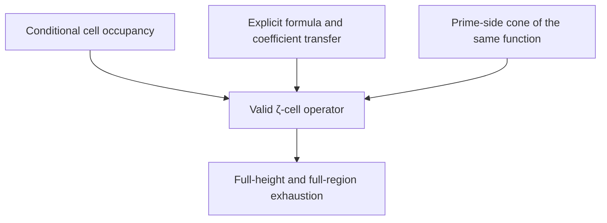

# Complete Report on Semi-AI Autonomous Research on the Riemann Hypothesis
## From Banded Multi-Test Functions to Local Interval Green 58-Cell Cover: Results, Failures, Trust Boundaries, and Subsequent Handoff for v0.1–v1.0

**Integrated Version:** v1.0  
**Date:** 2026-07-25  
**Research Mode:** Semi-AI autonomous mathematical research  
**Research Environment Authorization and Review:** Neo.K / EveMissLab  
**Technical Research Judgment:** AI research collaborator, unless otherwise marked within nodes  
**Main Chain:** `RH-BMCC-20260724-v0.1` to `RH-LocalIntervalGreen-CellCover-20260725-v1.0`

---

## 0. The Most Important Conclusion

This research neither proves nor disproves the Riemann Hypothesis, nor does it yield any result that could be called an "almost complete proof of the RH."

What was truly accomplished in this round is something else: taking a research route that easily conflates local negative values, arithmetic positivity, zero counts, location occupancy, and global RH conclusions, and progressively decomposing it into auditable mathematical objects. Along the way, invalid transfers were eliminated using exact counterexamples, low-value function classes were eliminated using dual witnesses, and finally, a rigorous interval certificate was obtained within a well-defined abstract Green/operator model.

As of v1.0, the highest positive technical conclusion is:

> For the fixed abstract clamped Green model inherited from v0.7, let $58$ axis atom locations vary independently around their respective centers. When the closed interval half-width for each location is
>
> $$
> h=\frac{89}{50\,000\,000}=1.78\times10^{-6},
> $$
>
> and the child parameter is $\alpha=1$, the projected abstract operator is strictly positive for all location choices within the product box; this maximal certified box and all rational closed subboxes contained coordinate-wise within it form a downward-closed certificate family.

The primary interval quantities for this certificate are:

$$
\eta_{\mathrm{Neu}}
\le
0.0275572505340
<1,
$$

$$
s_{11}
\ge
0.3305743170401,
$$

$$
\det S
\ge
6.69375118838\times10^{-5}.
$$

Compared to the conditional radius of v0.9

$$
2\times10^{-15},
$$

the radius improvement in v1.0 is exactly

$$
890\,000\,000
$$

times.

However, the following states all remain `false`:

| Global Interface | State |
|---|---:|
| `rh_proved` | `false` |
| `rh_disproved` | `false` |
| `actual_zeta_occupancy_family` | `false` |
| `zeta_facing_count_and_tail_coefficients_certified` | `false` |
| `explicit_formula_transfer_certified` | `false` |
| `global_rh_certificate` | `false` |

Therefore, what v1.0 proves is a local universal proposition for an abstract operator family, not that "actual $\zeta$ zeros fall into these $58$ small boxes," nor an explicit formula contradiction.

---

## 1. Proper Decomposition of the Research Problem

### 1.1 The Contradiction Framework Intended to be Established

The original goal of this route was to translate "if an off-axis zero exists" into two mutually exclusive conclusions on the same test function. The ideal form is:

$$
Q_{\mathrm{zero}}(f)<0
$$

and

$$
Q_{\mathrm{arith}}(f)\ge0,
$$

then, via a valid explicit formula identity with no circular dependencies,

$$
Q_{\mathrm{zero}}(f)
=
Q_{\mathrm{arith}}(f)
$$

obtain a contradiction.

If a rational cell $C$ is used to isolate a hypothetically existing cluster of off-axis zeros, the required zero-side domination can be abstractly written as:

$$
Q_{\mathrm{target},C}(f)
\le
-c_C m_C,
$$

$$
Q_{\mathrm{rest}}(f)
\le
E_C,
$$

and

$$
E_C<c_Cm_C.
$$

What is truly difficult is not any single local negative value, but simultaneously and validly completing the following five layers:

1. Deriving a cell occupancy with multiplicity and endpoint conventions from the assumed existence of off-axis zeros;
2. Establishing a zero-side operator inequality for all possible locations within the cell;
3. Proving that the test function satisfies the analytic admissibility and limit exchanges required by the explicit formula;
4. Establishing theorem-backed count, tail, and prime-side directions for the same function;
5. Completing a local-to-global exhaustion over all possible cells and infinite heights.

v0.1–v1.0 primarily advanced the abstract version of Layer 2, and precisely discovered that Layers 1, 3, and 4 had been erroneously conflated. Layer 5 has not yet begun substantive closure.

### 1.2 Why "Local Negative Values" Are Far From Enough

The prehistory `CASE-0001-RH-EAO-INTEGRATION-20260724` has already replayed a verified intersection on a single function and a single synthetic rectangle:

$$
\sup_{w\in[8,8.5]+i[-0.2,-0.1]}
2\operatorname{Re}(G(w)^2)
\le
-2.2416560599\times10^{-6},
$$

and:

$$
Q_{\mathrm{arith}}(\psi)
\in
[0.033762674558557,\ 0.061347696341296].
$$

However, the positive contribution of the first known critical-line zero is approximately $2387.591$ times the target negative margin; the cumulative amount of the first $50$ known on-axis zeros is approximately $10583.150$ times. This directly vetoes the notion that "a single local negative window plus a single arithmetic positive scalar is sufficient."

Therefore, the starting point for v0.1 was not to continue deepening the local negative value, but rather banding, multi-test functions, covers, and a global leakage budget.

---

## 2. Scope and Lineage

### 2.1 Methodological Prehistory

This integration package compiles the following materials as prehistory and methodological sources, without counting them among the ten main certificate nodes of v0.1–v1.0:

- Six internal theoretical drafts: centering, equivariant parent spaces, orbit types, effective divisors, winding number obstructions, rational rectangular decision families, explicit formula admissible test functions, and conditional contradiction frameworks;
- Six engineering packages: regional phase shaping, arithmetic matrix prototypes, separation-positivity intersections, verified intersection certificates, zero-side leakage budgets, and axis-suppressed optimizers;
- Prehistory integration package `RH_Equivariant_Arithmetic_Obstruction_Integration_v1.0.zip`.

These materials provide the problem language, method selection, and initial failure signals; they do not automatically become dependencies for the later interval certificates, nor are they elevated to a formalized RH equivalence chain just because the later certificates succeeded.

### 2.2 Ten-Node Main Chain

| Version | Node | Core Question | Final Verdict |
|---:|---|---|---|
| v0.1 | Banded Multi-Test Cover | Can banding, multi-functions, and adaptive covers close the budget? | Local cover successful; global budget entirely negative |
| v0.2 | PSD Gram | Can full Gram cross terms fill the gap? | Improved; all budgets still negative |
| v0.3 | Axis-Target Dual | Is the $R=3$ finite family already blocked by duality? | Named finite model rejected |
| v0.4 | Support–Prime Frontier | Is increasing support worth it? | coarse-grid false escape; cost explosion |
| v0.5 | Axis Notch Co-design | Can notch/lift pass through the gate? | Homogeneous notches have monotonicity obstructions; tested lifts saturated |
| v0.6 | Paley–Wiener Extremal | Can it be changed to a continuous kernel dual? | Continuous model theorems and floating witness completed |
| v0.7 | Interval Green Certificate | Can a fixed witness be strictly intervalized? | Abstract interval certificate successful; coefficient semantics failed |
| v0.8 | Zero-Count Semantics | Can counts be validly converted to operator mass? | Universal transfer vetoed by exact counterexample |
| v0.9 | Occupancy Operator Family | Can cell occupancy support a universal operator family? | Abstract transfer and synthetic cover completed |
| v1.0 | Local Interval Green Cover | Can the 58-dimensional location box be significantly expanded? | $h=1.78\times10^{-6}$ abstract certificate completed |

Full node IDs, source ZIP hashes, and byte-exact evidence snapshots are located in `metadata/`, `validation/`, and `evidence_snapshots/`.

---

## 3. Unified Evidence Semantics

Various nodes previously used slightly different `E0`–`E3` designations. To avoid cross-version misinterpretation, this report adopts the following semantic categories:

| Category | Meaning | What can be inferred | What cannot be inferred |
|---|---|---|---|
| `EXACT_FINITE` | Rational/exact finite model results | Equalities, inequalities, or counterexamples for named finite objects | Continuous analytic transfers, conclusions for entire function classes |
| `MODEL_THEOREM` | Theorems within well-defined abstract analytic or operator models | Weak duality, Green kernels, Schur reductions within the model | The model is already equivalent to the zeta explicit formula |
| `REPLAY_STRUCTURAL` | Recomputable structural, serialization, or reconstruction checks | Output is consistent with in-program definitions | Floating-point results have become rigorous theorems |
| `FLOATING_DIAGNOSTIC` | Replayable floating-point research evidence | Search directions, failure signals, candidate selections | Universal continuous propositions or non-existence theorems |
| `INTERVAL_CERTIFIED_SYNTHETIC` | Directed interval theorems under synthetic premises | Universal propositions for synthetic models | The synthetic axiom is a zeta fact |
| `INTERVAL_CERTIFIED_ABSTRACT` | Directed interval theorems within abstract Green/operator models | The operator family is strictly positive | Actual zeta occupancy or RH |
| `EXACT_SEMANTIC` | Exact theorems regarding whether quantifiers, coefficient directions, and transfers are valid | Exclusion of incorrect typing and invalid inferences | Automatically providing an alternative zeta bridge |
| `EXACT_COUNTEREXAMPLE` | Exact counterexamples to a proposed universal rule | The universal rule is false | All adjacent methods are impossible |
| `ZETA_TRANSFER` | Theorem-backed actual $\zeta$ transfers | If completed, only then can the abstract model be connected to the explicit formula | This chain has no positive completed items |

The highest positive numerical evidence in this chain is `INTERVAL_CERTIFIED_ABSTRACT`, not `ZETA_TRANSFER`.

---

## 4. v0.1: Banding, Multi-Test Functions, and Adaptive Cover

### 4.1 Design

The target rectangle is:

$$
[20,20.5]\times[-0.2,-0.1].
$$

v0.1 split it into $18$ anisotropic patches, established $72$ candidates, and verified the cover using rational atomic cells; additionally, it performed $465$ rational probes and a dense-grid audit.

### 4.2 Results

- exact rational atomic cover: passed;
- all sampled core and crude continuous sign audits: passed;
- candidate arithmetic minimum: approx. $2.1517368757$;
- range of the partial global gap: approx.

$$
[-20.4018,\ -8.96858];
$$

- none of the $72$ candidates passed the partial global budget;
- known zero ordinates did not enter optimization, serving only as holdouts.

### 4.3 Interpretation

The most valuable conclusion of v0.1 was not finding a more elegant local function, but confirming that:

> Local sign engineering and finite covers are no longer the primary bottlenecks; the true bottlenecks are the global domination of the axis, tail, and unknown off-axis regions.

The stage-one LP of the diagonal cone is almost equal to the best single ray, so the next step was an upgrade to a full PSD Gram.

---

## 5. v0.2: Full PSD Gram Still Fails to Close the Budget

### 5.1 Design

v0.2 used $22$-dimensional Gram coordinates, testing requested ranks

$$
1,\ 2,\ 4,\ 8,
$$

using $A=LL^{\mathsf T}\succeq0$ to guarantee the algebraic PSD of the finite model.

### 5.2 Results

The dominant axis band for all $18$ patches was:

$$
A_1=[18,23].
$$

The sampled majorant reduction of the full Gram compared to the diagonal baseline was:

$$
\min 0.1088656,\qquad
\operatorname{mean}0.2107757,\qquad
\max0.2866441.
$$

However, the numerical ranks of all selected factors collapsed to $1$. The final partial gaps remained entirely negative:

$$
[-141.93,\ -63.60]
$$

as the sampled range, while the Lipschitz-corrected range was approximately:

$$
[-353.16,\ -88.77].
$$

### 5.3 Trust Boundaries

This node used factorized nonconvex SLSQP, with no convex SDP solver and no global optimum claim. It only proves that "the tested full-Gram search was unsuccessful," not that the full PSD cone is globally infeasible.

### 5.4 Decision

Since the local majorant improved but the global gap remained substantially negative, the marginal value of further increasing similar primal ranks was very low. The research pivoted to the dual axis-target transfer lower bound.

---

## 6. v0.3: Eliminating the Named $R=3$ Class Using an Exact Dual Surrogate

### 6.1 Core Gate

The target budget was $1$, while the finite dual lower bound was:

$$
2.
$$

v0.3 established a rational surrogate for the tail witness and the $18$ patch witnesses; exact LDL positivity passed for all.

### 6.2 Numerical Scales

The minimum eigenvalue of the tail was approximately:

$$
0.03104147825.
$$

The minimum eigenvalues of the primary witnesses were approximately between:

$$
3.10421\times10^{-5}
\quad\text{and}\quad
3.10424\times10^{-5}.
$$

The optimal $\alpha$ for the tail plus hybrid remained significantly higher than $1$; the axis-only witness was close to null or slightly negative.

### 6.3 Correct Conclusion

This node is sufficient to reject the "named $R=3$ patchwise finite-model function class." It does not prove that there are obstructions for all support radii, all admissible functions, or the RH itself, because the Fourier/count/tail transfers remain at the floating-point layer.

---

## 7. v0.4: Support-Only Frontier, False Escapes, and Prime Costs

### 7.1 Cover and Radius Scanning

The original $18$ patches were refined into $288$ patches, testing a total of $126$ uniform configurations.

Observations:

- sampled center first escape: $R=10$;
- patch-measure first escape: $R=14$;
- however, after full refinement, all tested radii still had at least one blocked patch.

Named results are as follows:

| $R$ | dimension | strongest safe $\alpha$ |
|---:|---:|---:|
| $10.25$ | $100$ | $2.6200799$ |
| $12$ | $118$ | $1.8999498$ |
| $14$ | $138$ | $1.3981795$ |
| $16$ | $158$ | $1.09428134$ |

### 7.2 Coarse-Grid False Escapes

When the axis step was refined from $0.25$ to $0.025$, the raw $\alpha$ rose from approx.

$$
0.9853
$$

to approx.

$$
1.1923.
$$

Therefore, the "below $1$" on the coarse grid was a definitive false escape. From then on, any coarse-grid-only pass was classified as unacceptable.

### 7.3 Prime-Side Costs

In the $R=10.25$ benchmark:

- cutoff: $799\,902\,177$;
- primes: approx. $41\,141\,456$;
- prime-power terms: approx. $41\,144\,807$.

If expanded to $R=16$, the projected cutoff is approx.:

$$
7.8963\times10^{13}.
$$

This indicates that performing large-scale prime enumeration before the dual gate has been passed is an unreasonable engineering sequence.

---

## 8. v0.5: Exact Obstructions in Notch Subspaces

### 8.1 Dominant Frequency Bands

The peak atlas showed that the most difficult $A_1$ peak was approx. at:

$$
20.38,
$$

overlapping with the target geometry; other major peaks were approx. at $42.18$ and $83.05$.

### 8.2 Exact Monotonicity Conclusions

If notch constraints are merely homogeneous linear constraints, the resulting feasible set is a subspace of the parent feasible space. For the same minimization, shrinking the feasible set cannot improve the parent optimum.

Therefore, "only adding homogeneous notches" is not an effective breakthrough direction. This is an exact theorem within the model, not just a numerical failure.

### 8.3 Tested External Lifts

- the anchor-flat threshold actually worsened to approx. $33.845656$;
- the external lift $tq_R(t)\sin(\omega t)$ only improved by approx. $1.12\%$;
- the raw $\alpha$ for the best geometry `d12_w2_p5` was approx. $1.1435223$;
- the safe $\alpha$ was approx.

$$
1.0717612>1.
$$

### 8.4 Decision

Halt homogeneous notch subspaces, tested lifts, and polynomial bump scaling; rewrite the finite dictionary saturation as a continuous Paley–Wiener type extremal.

---

## 9. v0.6: Continuous $H_0^2$ Model and Low-Rank Green Reduction

### 9.1 Continuous Domain

v0.6 fixed $R=16$, working within the real-even clamped $H_0^2(-R,R)$ class, and added:

$$
G(0)=G(i/2)=0.
$$

The tail form was expressed using the Hilbert norm of the second derivative; the compact-support Fourier evaluation became a bounded linear functional.

### 9.2 Proven Model Theorems

This node accomplished the following within a well-defined abstract model:

1. Weak duality between the trace-class primal and the measure dual;
2. Closed form of the one-axis/one-core rank-two primal;
3. Clamped biharmonic Green kernel;
4. Finite-rank projection of two structural representers;
5. Schur reduction of the atomic PSD problem.

For

$$
W=I+UU^*-VV^*
$$

we have:

$$
W\succeq0
\iff
I-V^*(I+UU^*)^{-1}V\succeq0.
$$

Because the negative directions consist of only two core-imaginary directions, ultimately only a $2\times2$ Schur matrix needs to be verified.

### 9.3 Independent Numerical Cross-Checks

- finest Galerkin raw dimension: $192$;
- effective dimension after structural constraints: $190$;
- joint $\alpha$: approx. $1.1324752$;
- direct Green fixed-measure threshold: approx. $1.1324412$;
- absolute difference between Galerkin/direct Green at the selected point: approx.

$$
1.0534\times10^{-9}.
$$

The frozen rational candidate took:

$$
\alpha=\frac{21}{20}=1.05.
$$

The floating-point full minimum eigenvalue was approx. $0.3122432$, and the Schur minimum was approx. $0.0698852$, thus providing sufficient margin to warrant investing in an interval proof.

---

## 10. v0.7: Abstract Interval Certificate Successful, Zeta Bridge Failed in the Same Round

### 10.1 Interval Results

v0.7 established closed-form Green pairings, structural projections, a verified $60\times60$ positive solve, and a final $2\times2$ Sylvester test for all fixed atoms.

The certificate quantities were:

$$
\eta_{\mathrm{Neu}}
\le
7.53140475365\times10^{-15},
$$

$$
s_{11}
\ge
0.352427949645,
$$

$$
\det S
\ge
0.063615317260.
$$

Therefore, the fixed abstract operator is strictly positive at $\alpha=21/20$. The disk-read replay, exact serialization audit, and floating cross-check all passed.

### 10.2 Coefficient Orientation Blocker Revealed in the Same Round

After the successful interval operator certificate, a source-orientation audit was performed on the five-band coefficients. The results showed:

> The five stored positive band coefficients correspond to upper zero-count profiles; the inherited absolute-$S$ bound did not prove them to be the lower coefficients required for the zero-side.

When applying the witness to the stress test of the lower profile, the minimum eigenvalue was approx.:

$$
-5.53605.
$$

Therefore, the abstract certificate of v0.7 cannot be directly called an actual zero-side obstruction.

### 10.3 Why This is Not a "Certificate Failure"

Two things need to be separated:

- `abstract_continuous_interval_certificate = true`;
- `zeta_facing_count_coefficients_certified = false`.

The former is a valid in-model theorem, while the latter is a zeta transfer gap. The correct handling is to retain the former and retract the invalid elevation, rather than discarding all the work together.

---

## 11. v0.8: Exact Correction of Count Semantics

### 11.1 Valid Scalar Directions

If $q\ge0$ and there are $N(B)$ zeros in band $B$, then:

$$
\sum_{\gamma\in B}q(\gamma)
\le
N(B)\sup_{t\in B}q(t),
$$

and:

$$
\sum_{\gamma\in B}q(\gamma)
\ge
N(B)\inf_{t\in B}q(t).
$$

The upper count pairs with the supremum, and the lower count pairs with the infimum; the directions are not interchangeable.

### 11.2 Arbitrary Measure Transfer is False

A scalar lower count does not yield an operator lower bound on an arbitrary probability measure $\mu$. For moving rank-one evaluations, there is also generally no non-zero common PSD floor.

v0.8 vetoed the proposed universal rule using an exact two-point countermodel and a range-intersection argument. This is one of the most important semantic corrections in the entire chain.

### 11.3 Lower-Profile Numerical Diagnostics

Under the inherited floating lower profile:

$$
\alpha_{\mathrm{Galerkin},190}
\approx
0.1297047862,
$$

$$
\alpha_{\mathrm{direct\ Green}}
\approx
0.1297031276,
$$

while the sampled primal escape objective was approx.:

$$
0.1297069814.
$$

This indicates that the v0.7 obstruction cannot be preserved simply by recomputing the weights.

### 11.4 The Role of the Prototype Height

The height-$20.4$ patch used in the main chain is merely a geometry prototype. According to the rigorous verification source locked in by v0.8, it does not belong to the unresolved actual-zeta targets. Subsequent research must not pretend to search for off-axis $\zeta$ zeros at this height.

---

## 12. v0.9: Shifting from Scalar Counts to Occupancy Operator Families

### 12.1 Correct Transfer Semantics

Assume each cell has a source-valid occupancy, and one location is selected from each cell. If the core operator family can be proven to be PSD for all selected locations, then the remaining actual points only contribute a nonnegative PSD surplus, which can then be transferred to an all-point operator.

The key to this theorem is not that the count is more precise, but that it preserves:

- cell identity;
- multiplicity;
- endpoint conventions;
- the universal quantifier for each location;
- the PSD direction of the surplus terms.

### 12.2 Count-Only Exact Counterexample

The exact counterexample in v0.9 yielded:

$$
\det S
=
-\frac{254}{558009}<0,
$$

and a negative quadratic direction:

$$
-\frac{663194}{13755479859}<0.
$$

Therefore, a total count of two is still insufficient to deduce synthetic operator positivity.

### 12.3 Two Types of Certificates

First, the root box of the synthetic Dirichlet Green model was divided by the adaptive cover into:

- $8$ certified leaves;
- maximum depth $7$;
- unresolved leaves $0$.

Second, conditional on the v0.7 parent witness, the uniform radius for the 58 clamped positions was only certified up to:

$$
\frac{1}{500\,000\,000\,000\,000}
=
2\times10^{-15}.
$$

The floating-point corner search remained above the threshold at a half-width of $0.016$, and fell below it for the first time at $0.017$; however, this is not a universal counterexample.

---

## 13. v1.0: Local Interval Green 58-Cell Cover

### 13.1 Technical Changes

The microscopic bound in v0.9 primarily stemmed from an overly coarse global perturbation estimate. v1.0 directly established affine-tagged complex-exponent boxes for the location variables, enclosing the projected clamped Green pairings term by term, forming a $62\times62$ interval Gram family.

Among these:

- 58 axis locations;
- 2 core atoms;
- positive rank $60$;
- negative Schur rank $2$;
- the five-band atom counts are

$$
[22,\ 5,\ 14,\ 9,\ 8].
$$

### 13.2 Main Certificate

For independent choices of all $58$ locations:

$$
|x_j-x_j^{(0)}|
\le
\frac{89}{50\,000\,000},
$$

the abstract projected Green operator is strictly positive.

This is not merely verifying a single diagonal path, but a universal conclusion for the complete $58$-dimensional closed product box.

### 13.3 Downward-Closed Cover Family

If a rational closed subbox is contained coordinate-wise within the maximal certified box, the same enclosure certificate still applies. Thus, what is obtained is a downward-closed certificate family, rather than a single radius number.

### 13.4 Correct Classification of Failure Radii

The first tested failure radius was:

$$
\frac{9}{5\,000\,000}
=
1.8\times10^{-6}.
$$

It failed at the Sylvester lower bound. $10^{-4}$ and $10^{-3}$ failed at the Neumann inverse enclosure.

None of these imply the existence of a location that makes the true operator non-positive. On the contrary, along the inherited adversarial sign pattern, an exact rational corner point at a distance of $10^{-3}$ from the center was still rigorously proven to be positive.

Therefore, the currently certified radius is "the radius proven by this rectangular interval method," not the true maximum radius of positivity.

---

## 14. Failure-Correction Map

The main progress of this chain can be viewed as a series of controlled eliminations:

| Phase | Vetoed or Restricted Ideas | Evidence | Correction |
|---|---|---|---|
| Prehistory $\to$ v0.1 | A single local negative window is sufficient | axis leakage is far greater than the negative margin | Banding, multi-test, global budget |
| v0.1 $\to$ v0.2 | Diagonal cone is sufficient | All 72 candidates failed the budget | full PSD Gram |
| v0.2 $\to$ v0.3 | Increasing factor rank is sufficient | Ranks all collapsed to 1 | dual gate |
| v0.3 $\to$ v0.4 | The $R=3$ class is worth continuing to tune | exact rational dual obstruction | support–prime frontier |
| v0.4 $\to$ v0.5 | Support-only and coarse grids are reliable | false escapes, prime cost explosion | notch/geometry co-design |
| v0.5 $\to$ v0.6 | Homogeneous notches can improve the optimum | subspace monotonicity theorem | continuous extremal |
| v0.6 $\to$ v0.7 | A larger dictionary is the main bottleneck | independent solvers consistent to approx. $10^{-9}$ | freeze witness, intervalize |
| v0.7 $\to$ v0.8 | Abstract certificate can directly connect to counts | coefficient orientation blocker | typed semantics |
| v0.8 $\to$ v0.9 | Scalar counts can become operator mass | exact countermodels | occupancy + location quantifier |
| v0.9 $\to$ v1.0 | Global perturbation bound is a reasonable scale | microscopic radius | local Green interval engine |
| v1.0 $\to$ Subsequent | A larger abstract radius is the main GAP | zeta bridges all remain false | conditional cell + explicit formula |

This table also solidifies a research discipline:

> A single failure only eliminates the explicitly tested function class, transfer rule, or enclosure method; finite search failures must not be stealthily elevated into universal impossibilities.

---

## 15. Mathematical Assets Truly Completed in This Phase

### 15.1 Reusable Structural Theorems

- Finite auditable framework for adaptive rational cell covers;
- Machine interfaces for finite PSD Gram and dual witnesses;
- Support–prime cost frontier and dense-grid false-escape gates;
- Monotonicity obstructions of homogeneous notch subspaces;
- Clamped $H_0^2$ continuous weak duality;
- Explicit clamped Green kernels and structural projections;
- Low-rank Schur reduction of $I+UU^*-VV^*$;
- Valid upper/lower directions for scalar counts;
- Exact no-go from scalar counts to arbitrary operator mass;
- Conditional transfer theorem from occupancy-selection to all-point PSD operators;
- Affine-tagged local Green interval engine;
- 58-dimensional downward-closed product-box certificate.

### 15.2 Reusable Research Engineering

- Claim registers, gap ledgers, trust boundaries, and handoffs per node;
- Fixed-input and parent-hash locking;
- Separation of floating-point candidates and interval verifiers;
- Exact rational serialization;
- Failure injection, corner stress, and independent solver cross-checks;
- Canonical ZIP manifests and final evidence snapshots.

### 15.3 Most Valuable Negative Results

This chain leaves behind more than just "no success":

1. Local negative values are insufficient to dominate axis leakage;
2. Named finite families of diagonal/full-Gram are insufficient;
3. Coarse grids create false breakthroughs;
4. Homogeneous notches cannot improve the parent optimum;
5. Upper counts cannot masquerade as zero-side lower operator coefficients;
6. Scalar lower counts cannot masquerade as arbitrary location distributions;
7. Failed interval bounds are not point counterexamples;
8. Verified low-height geometry prototypes are not unresolved zeta targets.

These results directly narrow the erroneous search space for subsequent AIs.

---

## 16. Decisive Gaps Still Unfinished

### 16.1 Conditional Zeta Occupancy

What is truly needed is not a "table of actual off-axis zeros." If the RH is true, such a table does not exist at all. The correct contradiction interface should be:

> Assuming the existence of an off-axis $\zeta$ zero, one can select a rational cell, validly fix its boundary convention, multiplicity, and presence, and retain the unknown location as a universally quantified variable.

This conditional occupancy theorem is not yet completed.

### 16.2 Zeta-Facing Coefficients

The five-band coefficients and the tail scale must individually possess:

- Exact source theorems;
- All hypotheses;
- Validity ranges;
- Endpoint conventions;
- Correct upper/lower directions;
- Directed intervals;
- Source hashes.

Currently not completed.

### 16.3 Explicit-Formula Admissibility

It is necessary to prove that the clamped $H_0^2$ closure and the actually used test-function family satisfy all analytic conditions of the explicit formula, including:

- density;
- limit exchange;
- improper tails;
- zero sum and prime sum convergence;
- structural constraints;
- identity of the same function in operator and arithmetic expressions.

Currently not completed.

### 16.4 Prime-Side Cone

The prehistory only has an arithmetic-positive scalar certificate for a single function, lacking a general prime-side nonnegative cone. Large-scale prime enumeration should wait until the valid test function, support, and coefficient directions are frozen.

### 16.5 Global Exhaustion

Even if a parameterized cell is completed, it is still necessary to handle:

- All possible off-axis locations;
- Arbitrarily large heights;
- Multiplicities and boundary degeneracies;
- Unknown off-axis leakage;
- Tail;
- Count growth;
- Countable/finitely verifiable exhaustion of local certificates.

Therefore, `global_rh_certificate` remains `false`.

---

## 17. Suggestions for the Next Node: Stop Focusing Primarily on Radius

It is recommended to name the next node:

`RH-ConditionalOffAxisCell-ZetaTransfer-2026Q3-v1.1`

Core Question:

> Can a hypothetically existing off-axis $\zeta$ zero be validly mapped to a source-locked rational occupancy cell without using any "table of actual off-axis zeros," and then connect that cell to an explicit formula operator inequality with the correct direction?

The dependency relationships for the next round should be:



### 17.1 Work Package Sequence

1. `WP11-SOURCE-LOCK`  
   Freeze the original theorems, ranges, endpoints, and hashes for the zero count, argument principle/Turing semantics, tail bound, and explicit formula.

2. `WP11-CONDITIONAL-OCC`  
   Establish a rational cell occupancy schema for "if an off-axis zero exists." Unknown locations must be retained as quantified variables and cannot be replaced by synthetic centers.

3. `WP11-EF-TRANSFER`  
   Prove admissibility, coefficient orientation, and directed bounds for the same clamped test-function family.

4. `WP11-OPERATOR-BRIDGE`  
   Synthesize conditional cells with interval Green-Schur covers. If valid coefficients break the frozen witness, re-optimize or output a formal robust-failure record.

5. `WP11-UPPER-NOGO`  
   Separately complete the source certification for the upper-envelope route. This track must not be mixed with actual occupancy.

### 17.2 Strict Success Gates

The next node can only be marked as substantive progress if it simultaneously satisfies the following conditions:

- Every zeta-facing coefficient has a source theorem, valid direction, and directed interval;
- Occupancy is a conditional semantics derived from a hypothetical off-axis zero, not pretending that off-axis zeros already exist;
- The zero side and prime side use the same admissible test function;
- All location quantifiers are handled by interval covers or analytic theorems, not replaced by sampled grids;
- The result is a parameterized conditional cell theorem, or a formal no-go; it cannot merely report a larger abstract radius.

### 17.3 Stopping Rules

- Do not spend an entire round merely expanding the box by $1.78\times10^{-6}$;
- Do not treat the height-$20.4$ prototype as an unresolved target;
- Do not convert scalar counts into arbitrary operator measures;
- Do not use known zero ordinates as optimization equalities;
- Do not deploy large-scale primes before support and admissibility are locked;
- Do not treat finite dictionaries, nonconvex local optima, or failed enclosures as universal theorems;
- Do not use "RH proof," "RH disproof," or "global certificate" before the complete dependency graph is closed.

---

## 18. Handoff Protocol for Subsequent AIs

### 18.1 Initial Handoff Sequence

Subsequent AIs should read in the following order:

1. `README.md`;
2. This report;
3. `AI_HANDOFF.md`;
4. `metadata/ai-handoff.json`;
5. `metadata/claim-register.json`;
6. `metadata/gap-ledger.json`;
7. `metadata/failure-correction-map.json`;
8. `validation/source-archive-audit.json`;
9. `evidence_snapshots/` of the relevant versions.

### 18.2 Minimum Replay

Execute:

```bash
python3 validate_release.py --require-sources
```

and confirm:

- The SHA-256 of the ten canonical source ZIPs matches `metadata/artifact-index.json`;
- The CRC and internal manifests of the ten ZIPs all pass;
- The hashes of the $82$ evidence snapshots match their canonical ZIP members;
- All hard flags still retain their correct true/false values.

If only the final synthesis ZIP is obtained without external canonical sources, execute `python3 validate_release.py`; this mode verifies the in-package manifest, snapshots, and recorded canonical audit.

### 18.3 State Update Rules

If any subsequent node is to change a `false` to `true`, it must:

1. Point out the exact gap ID being closed;
2. List the theorem dependencies;
3. Provide source hashes;
4. Provide a machine-checkable artifact;
5. Update the claim register, gap ledger, dependency graph, and trust boundary;
6. Clearly distinguish between model theorems, interval theorems, and zeta transfers.

Without a new artifact, the state must not be upgraded relying solely on natural language re-description.

---

## 19. Integrity and Replayable Audit

This integration uses the ten ZIPs as canonical release objects, not the extracted working trees which might be altered by replays.

Audit results:

- canonical source archives: $10$;
- ZIP CRC pass: $10/10$;
- internal SHA-256 manifest pass: $10/10$;
- canonical core evidence snapshots: $82$;
- prehistory/methodological sources: $13$;
- main-chain `global_rh_certificate`: all `false`.

During integration, it was also discovered that `outputs/gram_results.json` in the local extracted v0.2 was truncated; the file of the same name in the canonical v0.2 ZIP is intact, and the internal manifest passed. Therefore, this report and the evidence snapshots strictly use the in-ZIP versions. This is working-copy drift, not canonical source archive corruption.

---

## 20. Final Research Verdict

This phase cannot deliver an RH proof, but it can deliver a much more solid result than "just another numerical attempt":

1. A ten-node, replayable, traceable research chain;
2. Multiple exact elimination results for named function classes and invalid semantic transfers;
3. A theoremized interface for a continuous Green/operator model;
4. A rigorous interval certificate for a fixed abstract witness;
5. A valid occupancy operator transfer framework;
6. A rigorous interval certificate family for a $58$-dimensional uncertain-location product box;
7. An AI handoff explicitly pointing out that "the next true bottleneck is not the radius, but conditional zeta occupancy and explicit-formula transfer."

The most precise phase summary is:

$$
\boxed{
\begin{aligned}
&\text{Abstract continuous Green/operator certificate: Completed;}\\
&\text{58-dimensional local location cover: Completed;}\\
&\text{Actual }\zeta\text{ occupancy and explicit formula transfer: Not completed;}\\
&\text{Global RH certificate: Not completed.}
\end{aligned}
}
$$

The research thus reasonably converges at v1.0. If restarted in the future, it should begin with the semantics and analytic bridge, rather than returning to unguided dictionary expansion or merely pursuing a larger local box.